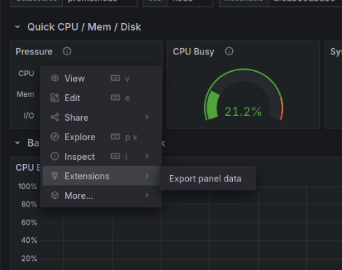
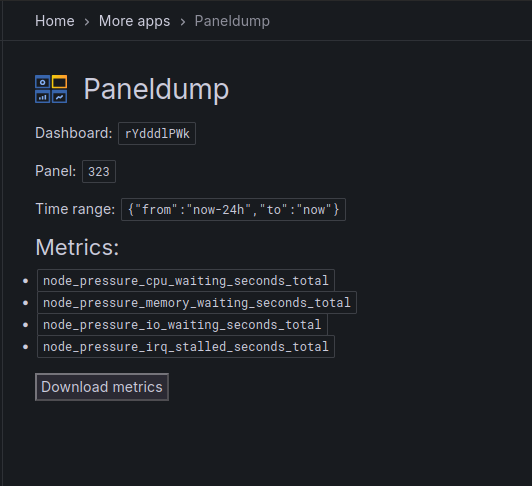
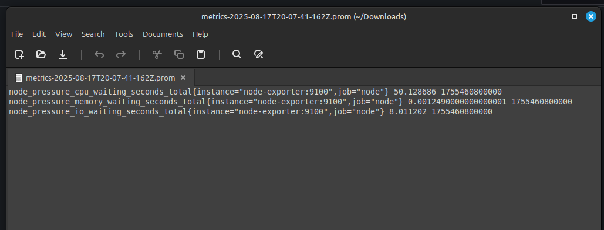

# Paneldump

**Paneldump** is a Grafana app plugin that exports raw metrics from a panel. The idea being that we want to be able to extract real data to serve as a baseline for alerts, rather than use a synthetic data generation language (like promtool).

Metrics are exported in prometheus text exposition format, with timestamps.

## How it works

1. The user presses 'Export panel data' from a panel's context menu. 
2. The user gets redirected to `paneldumps`'s page, which will be filled in with the information of the dashboard, panel and selected time range. 
3. The plugin extracts the query/queries of the panel, and send them to the plugin's **go backend**. 
4. The backend fills in Grafana macros with placedolders (think `$__interval` -> `1m`) 
5. The backend extracts the metric names that are present in the query, sending these back to the frontend
6. The fronted uses Grafana's HTTP datasource API to query prometheus for the requested metrics.
7. Some chatGPT generated code converts it from Grafana/Prometheus response format into text exposition format.

### Panel context menu

### paneldump plugin page

### Output in prometheus text format

## todo
Look into instant / interval query shenanigans, ensure we are getting correct results.

Integrate with [**eph**](https://github.com/JPBotelho/eph)

Consider storing in prometheus remote_write format.

Fork promtool and modify it to support reading metrics from file when unit testing alert rules.

Clean up the code. It was put together in 1 day.

## localdev

See the original Grafana template dev instructions [here](./devex.md)